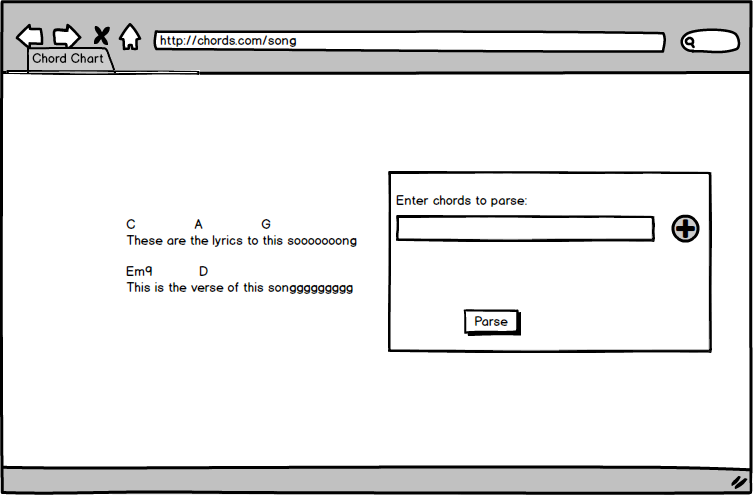
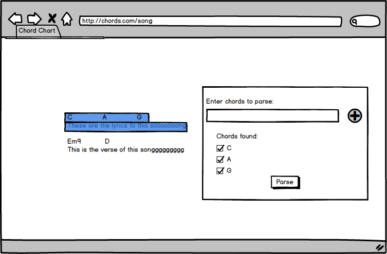
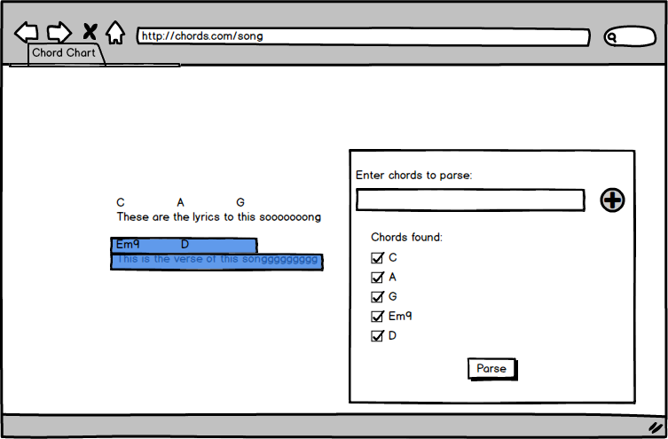
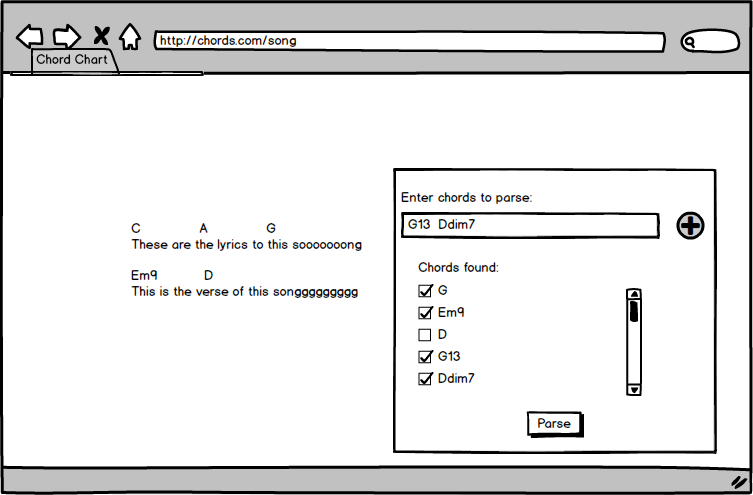
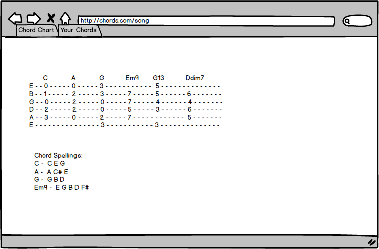
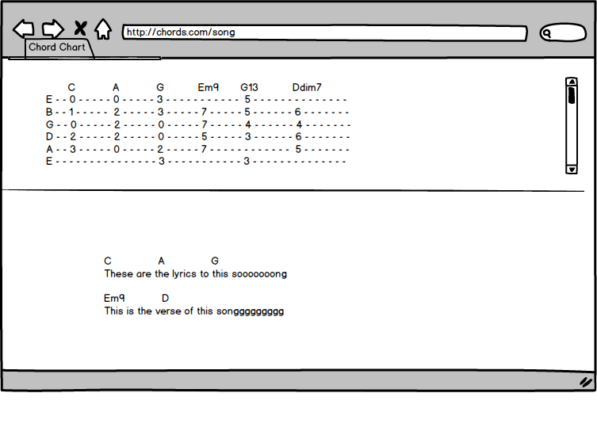

## Chord Parser

### Background
Chord Parser is a chrome extension designed to make it easier for guitarists
to figure out chord charts.

There are a lot of resources out there for guitarists to learn songs and the
chord chart is the most succinct way to communicate the structure of a song.
However, it is difficult to keep switching between a chord chart and
the actual finger positions of a chord, especially if you're trying to learn
a song as fast as possible. This app aims to bridge this information gap
by keeping everything in one page.

## Functionality & MVP  

The app will have two modes of usage, both revolving around a keyboard shortcut.
The current default command will be Command+Shift+,(comma).

In the first usage case, the user will highlight any string of text with chord names. With
the keyboard command, the app will parse the text and return a page of guitar
chords written out in tablature that correspond to the highlighted text.

In the second usage case, the user will press the keyboard command to open up a text window. In the text window,
the user will enter a series of chord names separated by spaces. The app will then parse this text as in the
first case. This is useful in the case of images of chord charts.

The app will also be able to save these chord charts locally for easy recall.

### Wireframes
This is the window when the app is called by keyboard shortcut.

The app will automatically look for chords in the highlighted text.

Additional highlighted text will be added onto the current query

Chords can also be added on through the text input field

I am still deciding between displaying the chords on a seperate page or in line with the site. I will implement both.

### Architecture and Technologies
The project will utilize a couple of music-related javascript libraries to help out with the music logic behind the application.
 - VexChords for chord image display (https://github.com/0xfe/vexchords)

Otherwise, this will be purely JavaScript, HTML, and CSS.

### Implementation Timeline
**Day 1**:
  Text parser to chord data logic should be implemented. App should be able to differentiate between chord names and parts of other words based on context. App will also be able to show chord spellings based on chord type and be able to transpose these spellings based on the root note.

**Day 2**:
  App will be able to take input from the user and parse them into chords.

**Day 3**:
  Create views for the results of the app.

**Day 4**:
  CSS Styling and Bonus Features

### Bonus features
- [ ] Figure out the key of a song based on the chords given.
- [ ] Parse images of chord charts
- [ ] Chord image will appear on hover of the chord names instead of on a seperate page
- [ ] Option to parse all the chords on a page at once
- [ ] Implement an algorithm to decide which voicing to display based on the relative positions of all the other chords.
- [ ] Chord chart and standard notation images are generated instead of tablature.
- [ ] Save chord charts in the cloud so the user can take their chord charts with them.
- [ ] Option to switch chord voicings on a chord-by-chord basis, potentially dynamically altering the positions of the other chords
- [ ] Recommended notes to improvise with over each chord
