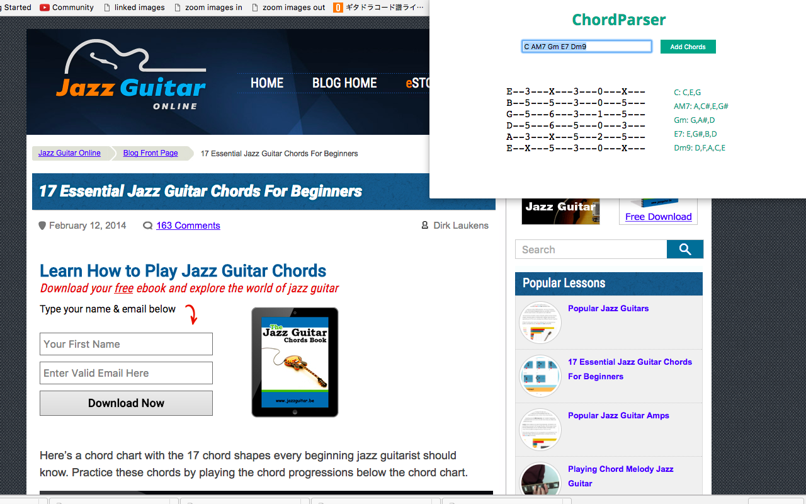

#Chord Parser
[Live Link]
[Live Link]: https://chrome.google.com/webstore/detail/chord-parser/bbpkjlgmmdpkdngmglgpfleidnfhecfi				

Chord Parser is the ultimate tool for guitarists who are learning to read chord charts. This extension allows you to see tablature for every chord in the song that you're learning without leaving the chord chart page to find every chord individually.

##Instructions
  Enter a set of chord names or copy and paste a whole text file with chord names in it. Chord Parser will pull out chord names and return tablature for each chord along with the spelling of each chord.

  This extension can take in a series of chords separated by spaces
  

  This extension can also take in a large body of text (such as all the selected text from a webpage)
  

##Technologies and Technical Features
This project uses the following technologies:
- Vanilla JavaScript and `jQuery` for handling text parsing logic
- Tonal for chord logic/formulas
- Webpack for creating a single point of entry for HTML script declaration

### Chord Parsing Logic
  This logic was created to take in any user input and only create output if there are valid inputs in the text. Due to the nature of music's limited alphabet, a lot of the work is already cut out for me in terms of filtering out non-musical input.

  

  In this screenshot, we are filtering the text down to any block of text that begins with a musical alphabet. This shuts out a lot of extraneous input.

  

  At this point, we have all the words that start with letters A-G. Chord qualities can be broken down to the following conditions shown in the screenshot above. Starting at the 1st index of each name allows us to remove small words such as "At" or "Be". We also have to worry about accidentals in the name (i.e. b and #). As such, if accidentals exist in the name, I can move the checking algorithms to check one letter over for the qualities. At this point, the final chord name is sent to the Tonal library to create the chord spellings for each chord. With the chord spellings, creating tablature for chords becomes trivial.

### Tablature Display
  Most of the chords that we use in guitar are based off of the drop-2 or barre chord shape. As barre chord shapes typically
  have the same order of degrees going across the strings (6th string degrees from low to high: 1st, 5th, 1st, 3rd, 5th, 1st), all we need to do is take the chord spelling (1 3 5) and plug it into the the tablature parser.

  

  To figure out where on a string a note is, I created an array with all of the possible notes and object indicating where in this array each string will start. I then grab the index of the chord tone as it is found in the possible notes array and I add this to the string's start index, keeping the number within a modulo of 12.

  

  To add the 7th degree, we need to find where in the 6th string chord formula the 7th will go. Unfortunately, since the whole formula is already filled with 1 - 3 - 5 degree, we need to choose which notes to replace. Without going into too much music theory detail, we replace the 5th depending on how far from the root the 7th is. Once we figure out this distance, we can decide how far to move the 5th, resulting in a chord with proper 7ths.
  <!-- As is typical in guitar chord theory, we eschew the 5th degree and replace it with the 7th. To change the position of the 5th to the 7th, we only need to move the existing note down the string. However, some chords have b7ths, which will change the positions -->

##To-dos/future features
  In future versions, I will be implementing the following features:
    - Ability to switch between 5th string and 6th string chord views
    - Extensions beyond 9th chords
    - Altered Chords
    - Key finder
    - Save functionality
